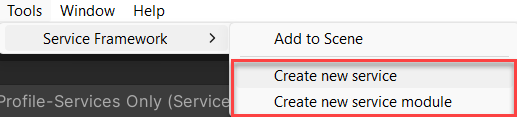

# Service Framework - Getting Started guide

***Last updated - 21st May 2022***

## Overview

Getting started with the Service Framework and creating your first service should be the simplest task you can complete, the harder part is discovering what kind of services are useful to your project and how best to plan for them.  The Service Framework has many advanced capabilities to handle most situations, however, let us get started with the basics and walk you through everything.

This is what this article will cover:

* [Installing the Service Framework](#installing-the-service-framework)
* [Adding the Service Manager Instance](#adding-the-service-manager-instance)
* [Creating the root configuration for the Service Manager](#creating-the-root-configuration-for-the-service-manager)
* [Using the Service Generator](#using-the-service-generator)
* [Configuring your service](#configuring-your-service)
* [Accessing your service](#accessing-your-service)

Time to begin.

---

## Installing the Service Framework

There are several different paths to install the Service Framework, which you choose will depend on how you prefer to access dependencies in your project:

### Open UPM CLI

The simplest way too install the Service Framework is using the [OpenUPM CLI](https://github.com/openupm/openupm-cli) which is an installable NPM package that will automatically download and register packages hosted on OpenUPM in to your Unity project.

> This method does require npm (node package manager) to be installed on your machine, [for more details see here](https://docs.npmjs.com/downloading-and-installing-node-js-and-npm).

Once Installed, simply open a command window/terminal in your Unity project (at its root) and use the OpenUPM CLI Command:

```text
    openupm add com.realitytoolkit.service-framework
```

Once complete, you can open your Unity project and the Service Framework and any dependencies will be automatically registered in your project.

### Unity Package Manager - manual

Alternatively, you can register the scoped registry for the Service Framework manually in the [Unity Package Manager](https://docs.unity3d.com/Manual/Packages.html) in the editor.

- First, open up the [Scoped Registry interface](https://docs.unity3d.com/Manual/upm-scoped.html) in the Unity editor and add a new entry in the Scoped Registry list:

```text
    Editor -> Edit -> Project Settings -> Scoped Registries
```

- Next, Enter the following details in to the window to the right:

```text
    name: OpenUPM
    url: https://package.openupm.com
    scopes: com.realitycollective
```

Once entered, click the "**+**" button to add and save the registry.

> For the Reality Collective packages (such as the Service Framework) that are still in preview, make sure to also check the "**Enable Pre-Release packages**" option in the top of the Scoped Registry screen, as shown below.

- Finally, Open the Unity Package Manager, in the top-left most drop down, select "My Registries" and then select and click install on the Service Framework entry to download and register the service framework and its dependencies in your project.


---

## Adding the Service Manager Instance

The Service Manager Instance is the ONLY MonoBehaviour GameObject that needs to be in a scene to operate any/all services that are registered with it, this ensures that all the events raised by Unity can be properly propagated (sent to) all the services.

> There is an additional pattern available whereby the Service Framework can be integrated with your own functionality, not requiring the additional GameObject, essentially providing the Service Framework as a property in your own code.  see the [Service Patterns and implementations](./05_service_patterns.md) for more information.

1. To begin, simply create an Empty GameObject (*Editor -> GameObject -> Create Empty*) and call it the "Service Manager Instance"


2. Then simply add the "Service Manager Instance" component by selecting the GameObject created in the previous step and clicking on "Add component" in the inspector and searching for the "Service Manager Instance".

By default you will receive an information box telling you that you do not have any root configuration for the Service Framework available.  The next section will walk you through creating it.

> If you already have Service Framework configuration in your project, the editor will bring up a new window to select it if you have more than one.  If you only have one, it will automatically be applied to your new Service Manager Instance.

Now that the Service Manager is in your scene, you can select it to see its current configuration.  By default, no configuration is applied and you will need to create your own configuration for it.

---

## Creating the root configuration for the Service Manager

The simplest way to create your first new Root configuration for the Service Framework is to select the "**+**" symbol on the "**Reality Toolkit configuration Profile**" field in the inspector with the "Service Manager Instance" selected.

This will automatically create you a new configuration file called "**ServiceProvidersProfile**" in the root of your assets folder.  Feel free to move this wherever you like in your assets folder as it will remain references to the instance of the Service Framework.

Alternatively, you can create it manually in the Project window by "*right-clicking*" and selecting "***Reality Collective -> Service Framework -> Service Providers Profile***", which will create the new profile in the folder you are currently viewing.  You will then need to manually assign this profile to the Service Manager by dragging and dropping it in to the "Reality Toolkit configuration Profile" field in the inspector.

> Also available through the "Assets" menu in the editor under the same path mentioned above.

Once configured, the Service Framework is ready to receive the services you create and get them running.


There are additional options you can enable on the Service Framework Instance, which have the following behaviours:

* Initialize on Play - Will only initialize the framework configuration when you hit **Play** in the editor, else it will always run and validate your configuration.  *Note this does not affect runtime, where the Service Framework always starts.

* Do Not destroy Service Manager on Load - By default, the Service Manager Instance will set itself to initialize in to a separate scene and will stay running for the life time of the project.  If you want to have separate Service Managers in eah scene, then disable this option.

---

## Using the Service Generator

Creating your first service is relatively easy, the hardest part is knowing what you want your service to do (check out [the examples](./01_introduction.md#use-cases-and-what-is-a-service-anyway) in the Introduction).  For the code, we have included a quick and easy **Service Generator** to get you going.



In the Unity Editor menu under **Reality Collective** (where all Reality Collective tools are maintained), you will find the menu item for the **Service Framework** with two entries for:

* Create new service
* Create new data provider (to be covered later in [Advanced Service Design](./04_advanced_services.md))

On selecting the **Create new service** option, you will be presented with the **Service Wizard** window to choose your service generation options:


The options for generating your service are very easy to use, simply enter:

* Output path - Where you want the service files to be generated into (the default is the root of your Assets folder)
* Namespace - The [C# namespace](https://docs.microsoft.com/en-us/dotnet/csharp/language-reference/language-specification/namespaces) you want to be applied to your service (we always recommend using a namespace to uniquely identify your own code)
* Instance Name - The new name for your service

Once you have entered the details for your new service, just click on **Generate!** and the generator will automatically create a blank service, interface and profile in the folder you specified.


> The Service Framework uses an [Interface](https://docs.microsoft.com/en-us/dotnet/csharp/language-reference/keywords/interface) for the service to uniquely identify it for Registration and for Retrieval.  It is also very useful for ensuring that any other implementations of the service (for other platforms or for creating a Mock implementation for [Unit Testing](https://www.c-sharpcorner.com/article/a-basic-introduction-of-unit-test-for-beginners/)) have the same implementation.

If you look in the newly generated service file, you will find documented instructions for the methods that are supported.  Any you do not need or do not intend to use can be safely removed without any impact.

> **DO NOT** alter the Service Constructor signature, as this is used by the Service Framework when registering your service.

Please see the [Service Design](./03_service_design.md) section for more details on how services are made and operated.

---

## Configuring your service

With your service generated, it will now be accessible to register in the Service Framework configuration which you can access via the Inspector with the **Service Manager Instance** selected:


> If you have not [created the configuration shown above](#creating-the-root-configuration-for-the-service-manager), you will need to do that now.  The Service Framework **ALWAYS** needs a Root configuration to function.

To then add a new Service entry, simply click the "**+**" in the **IService Configuration Options** section, which will create a new entry to configure:


Here you you would:

* Give your Service a **Name** in the Name field
* Select your Service **Instanced Type** from the Drop-down (more on that shortly)
* Once the Instance Type is selected, you can also assign a Profile for the service, which is optional.  Click "+" to create a default configuration for the Service.
* Select the **Platforms** the service will run on, the list shows what is available to Unity by default [but can be extended](./06_platform_system.md)

Clicking the **Instanced Type** drop-down shows the list of services detected by the framework, grouped by Namespace (that you entered when you created the service):


> If your service does not show up in the list, make sure the Namespace is accessible, especially if your Service is located in a folder with an Assembly Definition (which limits how code is accessed). Just create a new C# script and try to create a new instance of your Service Manually (var test = new TestService())

> If you ALSO want your service to be accessibly when hitting Play in the Editor, make sure to also select the **Editor** platform (or select "Everything").  The system does EXACTLY as it is told and will only try to start your service on the platforms it is told to.

With your service configured and available to run it is now available from ANYWHERE in your project.

> It is also possible to register services in Code rather than through the configuration screens.  You can even mix and match, with some services registered in configuration and some registered in code.  Just remember, **a SINGLE service can ONLY BE REGISTERED ONCE**, you will get a warning if you try to register the same service twice.  See the [Service Design](./03_service_design.md) for more details on using the Service Framework from code.

---

## Accessing your service

Getting a reference or accessing the instance of your running service is VERY easy and the Service Framework offers two patterns for accessing your service:

### Check your Service is registered

If there is ever a situation where you may not be sure your service is registered or running, the Service Framework has an easy check to see if the Service is currently registered with the Framework, this is done by calling the **IsServiceRegistered** function:

```csharp
    if (ServiceManager.Instance.IsServiceRegistered<IMyNewService>())
    {
        // My Service is Registered
    }
```

This simply returns True if the Service is registered.  You can also check if the Service is enabled (as Services can be disabled once registered) by using the **IsServiceEnabled** function.

### Get a reference to your service using GetService<>

The common way to get a reference to your running service is to use the **GetService** function.

```csharp
    var service = ServiceManager.Instance.GetService<IMyNewService>();
```

This will return null and log an error if the service was not found.

### Safer access to Getting a Service

As an alternative to the GetService call there is also a **TryGetService** function which returns a Bool to denote whether the Service request was successful and an out parameter with the Service instance if it was found:

```csharp
    IMyNewService myService = null;
    if(ServiceManager.Instance.TryGetService<IMyNewService>(out myService))
    {
        // My Service was found
    }
```

This is generally the better approach but it all depends on the usage of your service.

### Check the API docs for more calls

There are a few more accessors for getting references to services, such as:

|Function|Description|
|---|---|
|GetServiceAsync|An Async version of the GetService call|
|GetServiceByName|Return a service by its name|
|GetServices<T>|Returns a collection of all services of an Interface Type currently registered|
|GetAllServices|Returns a collection of all services currently registered|
|DisableService|Disables a running Service|
|EnableService|Enables a disabled Service|
|DisableAllServices|Effectively pauses all running services|
|EnableAllServices|Restarts all paused services|
|||

See the API Docs (coming soon) for more detail.

---

## Onward

Check the other documentation for more detail on how services work and how to extend them as the capabilities of the Service Framework are quite extensive.

## More information

for more information on the Service Framework, check out these additional links:

* [Introduction](./01_introduction.md)
* [Service design](./03_service_design.md)
* [Advanced services and sub services (data providers)](./04_advanced_services.md)
* [Service Patterns and implementations](./05_service_patterns.md)
* [Platform System](./06_platform_system.md)
* [Roadmap](./07_roadmap.md)
