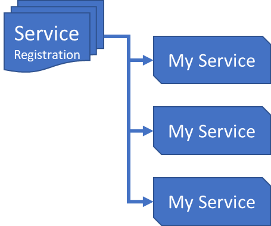
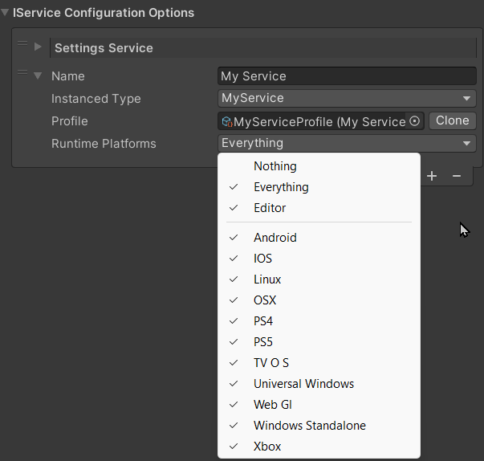
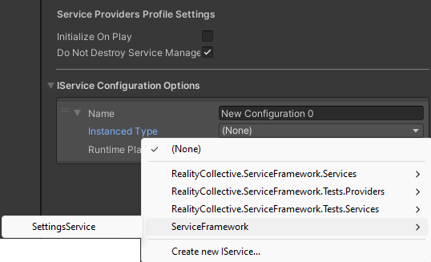
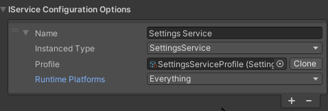
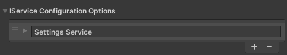

# Service Design

***Last updated - 27th February 2024***

## Overview

This article will cover what makes a service tick as well as good patterns to follow in service design, effectively what goes into making a good service, as well as a more full-featured example.

:::tip

For more advanced information on the different patterns that can be used in Service Design, check out the [Service Patterns and implementations](./05_service_patterns.md) section.

:::

This article will cover:

* [What is a Service?](#what-is-a-service)
* [Using a Service Profile](#using-a-service-profile)
* [The Monobehaviour events](#the-monobehaviour-events)
* [Platform support](#platform-support)
* [CoRoutines and async](#coroutines-and-async)
* [Service Hooks and events](#service-hooks-and-events)
* [Tutorial: Building a Settings Service](#building-a-settings-service)
* [Tips and tricks](#tips-and-tricks)

Time to begin.

---

## What is a Service?

A basic question with a simple answer, what exactly is a `Service`?  In short, a Service is nothing more than a Game Component in Unity with one key exception, Unity is not running the show.

### Performance

When you use a MonoBehaviour natively, you get all the events and data that Unity sends you each cycle whether you want it or not, multiplied by all the different GameObjects and components in your project updated each update or fixed update cycle can lead to performance issues.  The cost is marginal but not linear, some components do more work than others and finding out which is causing what can be tricky.  With the Service Framework however, there is only ONE GameObject and ONE MonoBehaviour, no matter the work that is done by services in the framework, the performance cost is the same (in Unity terms) and any performance hits are easier to identify because you no longer have Unity as part of the equation, while still retaining all the benefits and access to the information Unity gives each cycle.

### Accessing your code

The other advantage of building your code as a service is that it is accessible anywhere at any time with practically no overhead, no using GameObject.Find and hope that Unity finds it, no wondering if your scene / gameobject references got messed up from a rogue GIT check-in or Unity update. And if you have components/services that depend on each other, it is far easier to get them connected and working.

### Testing

Testing is also a huge advantage because all services require an [Interface](https://learn.microsoft.com/en-us/dotnet/csharp/language-reference/keywords/interface) they are ultimately very testable. Unit Testing, while sometimes onerous, can be vital in building a solution that is not going to surprise you when it is run and let you know ahead of time if a problem is likely to happen (code can even be tested outside of Unity if need be).  But Testing is always optional, who needs to test anyway :D

### Summary

There are many other benefits from building a service over the traditional methods used to create fully reusable code or features that your title depends on, these are but a few.



In short, Services are distinct features and reusable code that your project/game will use, built in a safe, structured and easily accessible way.

---

## Using a Service Profile

In Unity you can expose properties from your code that the editor will see and let you configure, either through Public properties or private properties decorated with the `SerializeField` attribute.  While useful, this can create issues for code that is dependent on these settings across scenes.

With Services you have the option to create a [Scriptable Object](https://docs.unity3d.com/Manual/class-ScriptableObject.html) that is configured against the service for use at run-time, this has many advantages, such as:

* The settings are in a separate file, not bound to any one scene (if you need scene dependent config, then just build that in to your configuration)
* You can use different "**profiles**" for different situations as you wish.
* Changing settings can be done separately, and does not require you to change it in all scenes.  Sure, you could use a prefab, however that too has its own problems.
* The configuration is separate from all the jargon in a scene asset.

In short, you are simply creating a class that holds just the configuration for your service and keeping it separate and in a controlled way, especially when you are working in source control.  Gone are the days of someone checking an update in to Source Control and settings being lost.

---

## The Monobehaviour events

As well as being able to run your own independent code, you can also make use of the MonoBehaviour events that Unity provides as overrides.  This is completely optional of course, if you do not need the "update" method, then do not use it.

You have full access to all the events Unity exposes:

* public override void Initialize()
* public override void Start()
* public override void Reset()
* public override void Enable()
* public override void Update()
* public override void LateUpdate()
* public override void FixedUpdate()
* public override void Disable()
* public override void Destroy()
* public override void OnApplicationFocus(bool isFocused)
* public override void OnApplicationPause(bool isPaused)

> Check the [Unity documentation](https://docs.unity3d.com/ScriptReference/MonoBehaviour.html) on the details behind these MonoBehaviour calls

---

## Platform support

Services can be configured to only activate when a particular [platform](/docs/features/platform_system.md) is active (being run on), this is useful in those situations when a service only needs to run on a specific platform or platforms.

:::note

Only want a specific piece of functionality to run on iOS and NOT Android, then create a service and limit its running to just Android (and Editor, if you want to test in the editor)

:::



> See the [Platform System](/docs/features/platform_system.md) section for more details on the Platform System.

---

## CoRoutines and async

One crucial difference between a Service and a Component/GameObject, is that it does not have a presence in the scene, this does not cause issue in most cases with the exception of CoRoutines.  If your service needs to run a CoRoutine, then the Service Framework (via the Reality Collective [Utilities library](https://github.com/realitycollective/com.realitycollective.utilities)) provides a helper in order to enable a service to initiate CoRoutines, as follows:

```csharp
    using RealityCollective.Utilities.Async;

    public void MyMethod()
    {
        AwaiterExtensions.RunCoroutine(MyCoRoutine());
    }
```

Alternatively, use [Async methods](https://learn.microsoft.com/en-us/dotnet/csharp/programming-guide/concepts/async/) instead, which perform the same function but are considered a little safer (just a little trickier to wrap your head around).

---

## Service Hooks and events

In most services that perform actions that you want to then inform the calling code that "something" has happened, you require a pattern where the calling code can bind to the service to receive those events.
For example:

* You call a "Load File" method on your service
* You then want to know when the file is downloaded (which might be some time)

There are a few methods for doing this ranging from:

* Delegate callbacks
* Async code
* Using delegate events

All are valid when using services (just make sure to clean up after yourself when the service is disposed of). Primarily Async is generally better as you can see the code flow properly but it can make it harder to debug.
In the Reality Toolkit and other service implementations, the recommended pattern is to use an event Delegate using [Unity's "Action" events](https://docs.unity3d.com/ScriptReference/Events.UnityAction.html), especially as the Service Framework is built up on top of the Unity Event System.

To create an **Action** Delegate event in your service simply use:

> If you prefer, you can alternatively using the built in Action type of UnityAction, which Unity has provided to make Action more versatile.

```csharp
    event Action MyEvent;
```

This should be declared in your Service Interface and then implemented in your service.  When the service needs to raise the event it need only do the following:

```csharp
    MyEvent?.Invoke();
```

> The **?** is important so that Invoke is only called when a client has subscribed to the event.  Invoke is "meant" to be safe to call at anytime, but it is better to be safer.

Any client code that then needs to listen to the event simply needs to call the following **BEFORE** any code that could make the event happen (Chicken and Egg, make sure you have a chicken before you want eggs):

```csharp
    MyService.MyEvent.AddListener(methodToHandleEvent);
```

Unity also provides several overloads for the UnityEvent, enabling you also pass data back to the calling client code if need be.

:::tip

P.S. [Learn Async](https://learn.microsoft.com/en-us/dotnet/csharp/language-reference/keywords/async), your life will be easier/better/more confused for it.

:::

---

## Auto Start Behaviour

In some instances, it is better to have a service manually started rather than automatically when the Service Manager initializes, in these cases the advised pattern is to implement a `Start Behaviour` in the service profile and configuration, the recommendation for a Service Framework service is as follows:

* An `AutoStartBehaviour` profile configuration option.
* Update Service implementation to read this profile option and only start if the value is set to `AutoStartBehavior.AutoStart`.
* Implement Start and Stop methods in the Service interface, Service and Modules (if applicable).

### Profile setting

In the profile for the service, add the following property, which will allow the service to be configured to be automatically or manually started.

```csharp
    [Tooltip("Should the service start automatically or manually when required")]
    public AutoStartBehavior autoStartBehavior;
```

### Service configuration

The service should be updated to recognize the `AutoStartBehaviour` and adapt if it is set to manual:

```csharp
// Add a property to store the setting (or the entire profile)
#region Private Properties
private AutoStartBehavior autoStartBehavior = AutoStartBehavior.AutoStart;
#endregion Private Properties

// Update the constructor to capture the value from the profile
#region Constructor
/// <inheritdoc />
public MyService(string name, uint priority, MyServiceProfile profile) : base(name, priority)
{
    autoStartBehavior = profile.autoStartBehavior;
}
#endregion Constructor
```

Then using the `autoStartBehaviour` property, ensure that any code or functionality recognizes the value and does not attempt to start if the value is not set to `AutoStart`, making sure to also prevent any additional modules for the service (if used) are also not started. For example:

```csharp
public override void RegisterServiceModule(IServiceModule serviceModule)
{
    base.RegisterServiceModule(serviceModule);

    if (autoStartBehavior == AutoStartBehavior.AutoStart)
    {
        // Start modules for this service
    }
}
```

### Service Interface

The service interface should also be updated to include methods to `Start`/`Stop` the service on demand, this allows any functionality consuming the service the ability to perform those actions, we use the Interface as all instances of the service are returned via the Service Manager using the Interfaces and not the concrete instance of the service itself:

```csharp
#region Methods
/// <summary>
/// Command the service to connect and enter a running state.
/// </summary>
Task StartMyService();

/// <summary>
/// Command the service to stop and disconnect.
/// </summary>
void StopMyService();
#endregion Methods
```

:::warning

Do NOT forget to also implement these methods in your actual service as indicated above :D.

:::

---

## Accessor pattern

A common requirement when querying services to to just call `GetService<IMyService>` everywhere and there is little cost in doing so, but there is a better and more performant way.

The Accessor pattern is simply a property which when first called will attempt to get the service in question and after that it will used a cached version of the service from then on (it is the same concrete implementation, so it is always current).

So using the pattern below, you simply need call `SettingsService.MyMethod` in your class to access the service.  

:::note

Although, the value will be `NULL` if the service could not be found.

:::

```csharp
    #region Dependencies
    // Simple accessor pattern, similar to caching GameObject/Component references
    ISettingsService settingsService;
    protected ISettingsService SettingsService
        => settingsService ??= ServiceManager.Instance is null ? null : ServiceManager.Instance.GetService<ISettingsService>();
    #endregion Dependencies
```

---

## Building a Settings Service

The above does a lot of talk about what a service is and what you can put in to it, the `Getting Started` section also showed you how to make a service but not what to put in to it.  In this section, we will build a simple "Settings" service to manage the state of an application, including using a profile to set some defaults (that are configurable, not just hardcoded stuff in our code).

:::info

We will not the `AutoStart` behaviour above because we want the Settings service to always be on, and it has no dependencies.

:::

1. Use the `Service Wizard` to create a new service called `SettingsService` and place it into a new folder (using the `Output Path` button to choose and create a new folder), leave the options as default (so a Profile is created)
2. Starting with the `Interface` (**ISettingsService**), we determine exactly what our service is going to do, in this case:

    * Managing the state of whether the game has started or not.
    * The Max number of players that are supported.
    * A checkpoint integer to remember the last checkpoint the player reached.
    * And two functions to Save or Load the settings

    As shown below:

    ```csharp
        public interface ISettingsService : IService
        {
            bool GameStarted { get; set; }
    
            int MaxPlayerCount { get; set; }
    
            int PlayerCheckpoint { get; set; }
    
            void SaveSettings();
    
            void LoadSettings();
        }
    ```

3. To demonstrate the usefulness of `Service Profiles`, we will also enable the `MaxPlayerCount` to be configurable, so if you want to change it you do not need to do it through code, instead. we will use the profile.  Edit the `SettingsServiceProfile` and add the following.

    ```csharp
        [CreateAssetMenu(menuName = "SettingsServiceProfile", fileName = "SettingsServiceProfile", order = (int)CreateProfileMenuItemIndices.ServiceConfig)]
        public class SettingsServiceProfile : BaseServiceProfile<IServiceModule>
        {
            public int MaxPlayerCount; // <- Creating a profile configuration for MaxPlayers
        }
    ```

4. Next, we define the concrete implementation for the service, we are going to keep it simple here just as an example:

    ```csharp
        public class SettingsService : BaseServiceWithConstructor, ISettingsService
        {
            private const string MYAWESOMEAPPSAVENAME = "AppSaveSettings";
    
            #region Constructor
            public SettingsService(string name, uint priority, SettingsServiceProfile profile)
                : base(name, priority)
            {
                this.MaxPlayerCount = profile.MaxPlayerCount;
            }
            #endregion Constructor
    
            #region ISettingsService Implementation
            public bool GameStarted { get; set; }
            public int MaxPlayerCount { get; set; }
            public int PlayerCheckpoint { get; set; }
    
            public void SaveSettings()
            {
                PlayerPrefs.SetInt(MYAWESOMEAPPSAVENAME, PlayerCheckpoint);
                PlayerPrefs.Save();
            }
    
            public void LoadSettings()
            {
                PlayerCheckpoint = PlayerPrefs.GetInt(MYAWESOMEAPPSAVENAME);
            }
            #endregion ISettingsService Implementation
        }
    ```

    Nothing fancy, just getting the profile setting for `MaxPlayerCount` from the profile and Save / Load functions for the current value of the `PlayerCheckpoint`.

5. With everything coded, we just need to add our new service to a `GlobalServiceManager` configuration.  So open or create a new scene (We usually recommend the configuration should be applied in your first scene in your build settings, so it's up and running from the start) and add the ServiceManager using the Editor Menu option `*Tools -> Service Framework -> Add to scene*`.

6. Select the `GlobalServiceManager` in your hierarchy and then click `Create a new configuration profile` to add the main Root configuration for the Service Framework.  By default, this is added to the root of your project and then you can move it where you like.

    :::tip

    We usually recommend creating a new folder to store all your service configuration and keep it separate from the rest of the project and make it easier to find.

    :::

7. Now let us add and configure your new Settings Service by clicking `+` in the `IService Configuration Options` section and then select our Settings Service in the `Instanced Type` drop-down:

    

    :::note

    The drop-down navigates by namespace and then class, which is why we recommend using namespaces to properly design how your service will be discovered.

    :::

8. Because we opted to generate a Profile with the service, you can click the `+` symbol next to the Profile configuration to automatically create the profile for the Settings Service (you can also create one manually using the GameObject Create menu, because it is a scriptable object, and then search for it using the DOT symbol next to the Profile Property), the profile will then be automatically assigned too.  The profile is added to a folder of the same name as the profile, so feel free to move it elsewhere if you wish.
9. By assigning the Service Profile, it will also automatically open, allowing you to see the autogenerated Inspector window for the profile and letting you configure the `Max Player Count` option we added.

    :::note

    If you add data types that are not automatically identifiable, you will need to write a custom inspector for the Profile which inherits from the `ServiceProfileInspector` class, else it will have issues drawing.

    :::

10. Returning to the scene, select the `GlobalServiceManager` again to show the Service Framework in the inspector, the last thing to do is select the `platforms` the service will run on.

    :::tip

    Remembering from [Getting Started](./02_getting_started.md), the Service Framework will only do as it is told, if you configure a service to run on `Nothing` (the default) it will never start.

    :::

    Set this to "Everything" for now since there is no platform-dependent code in our service and it should be able to run anywhere.
    

    :::tip[Pro Tip**]

    If you collapse the Service definition in the Service Configuration Options, you can simply **click on the service** and it will automatically open the profile settings for the service, no need to keep expanding it just to open its settings.   You can of course just inspect the asset itself instead.
    

    :::

11. With your service running, here is the recommended way of setting up a class to use it.  Create a new C# script and add the following:

```csharp
    #region Dependencies
    // Simple accessor pattern, similar to caching GameObject/Component references
    ISettingsService settingsService;
    protected ISettingsService SettingsService
        => settingsService ??= ServiceManager.Instance is null ? null : ServiceManager.Instance.GetService<ISettingsService>();
    #endregion Dependencies

    void Start()
    {
        // Access our registered service and tell it to Load Settings
        SettingsService.LoadSettings();
        LoadCheckPoint(SettingsService.PlayerCheckpoint);
        //Update our settings Service and update the state for the game being started
        SettingsService.GameStarted = true;
    }

    void Update()
    {
        //Daft logic to repel players if we have reached our max player count
        if(CurrentPlayers > SettingsService.MaxPlayerCount)
        {
            //Sorry, you cannot enter.
            return;
        }
    }
```

:::warning

We only start querying for services from the MonoBehaviour `Start` method, during `Awake` services are still being registered and are not available yet!

:::

The code has been commented to explain each region, so hopefully it should be self-explanatory.

And that is it, we have:

* Created a new Settings Service
* Defined an interface to control access to what the service does (obviously you could add more internal code to do "stuff")
* Created a profile to allow MaxPlayers to be configurable
* Made the service real.
* Demonstrated a simple script to access the service.  The magic being, this could be anywhere and you will always find your service.

---

## Tips and tricks

Writing services is easy enough, working out yourself what each service is and what it should do is the hard part, but always remember:

* Use the Service Interface, it is a guide and a control to know exactly what a service does and what it provides, from the most basic to the very advanced.
* Take note of the Accessor Pattern used in the example.  You can just call `GetService<IMyService>` everywhere and there is little cost in doing so.  But the Accessor pattern is just cleaner.
* Remember, services can call each other. If one service depends on another, consider using constructor-based dependency injection for cleaner, safer code. See the [Dependency Injection](./07_dependency-injection.md) guide for details. If using runtime retrieval with `GetService<T>()`, make sure services are in the right order in the ServiceManager Inspector. Order matters!
* **NEVER** use `GetService` during `Awake`. During the awake loop, the ServiceManager is still waking up just like everything else so services will not have initialized yet.  Might be less critical by the second scene or so, but still something to keep in mind.
* If you tell a service NOT to start for a platform, it will not start :D
* Beware Null Ref Exceptions, if something is not started or initialized, it **WILL BE NULL.**

---

## More information

for more information on the Service Framework, check out these additional links:

* [Introduction](./01_introduction.md)
* [Creating your first service](./02_getting_started.md)
* [Advanced services and sub services (data modules)](./04_advanced_services.md)
* [Service Patterns and implementations](./05_service_patterns.md)
* [Scene based service loading](./06_scene_based_service_manager.md)
* [Dependency Injection](./07_dependency-injection.md)
* [Platform System](/docs/features/platform_system.md)
* [Roadmap](./07_roadmap.md)
