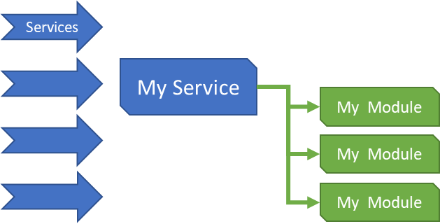
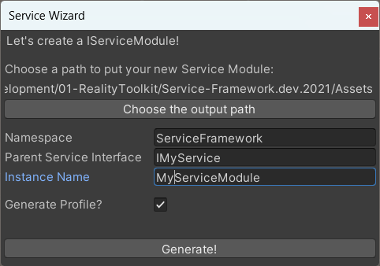
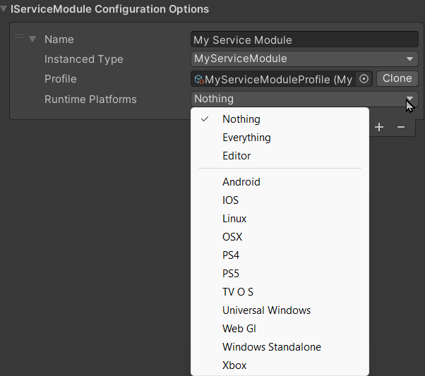

# Advanced Service design and sub services

***Last updated - 24th October 2022***

## Overview

This article will cover service modules and how they can extend capabilities beyond a single service through additional service modules added to the service to provide distinct operations and extensions.

> For more advanced information on the different patterns that can be used in Service Design, check out the [Service Patterns and implementations](./05_service_patterns.md) section.

This is what this article will cover:

* [What is a Module? (Sub Service)](#what-is-a-module)
* [Profiles for Modules](#profiles-for-modules)
* [Use cases for Modules](#use-cases-for-modules)
* [Platform support for Modules](#platform-support-for-module)
* [Pre and Post Service Processors](#service-processors)
* [Tutorial: Building a Leaderboard Service with modules](#building-a-leaderboard-service-with-modules)
* [Tips and tricks](#tips-and-tricks)

Time to begin.

---

## What is a Module?

In the simplest terms a Module is essentially a Sub-Service, a child service that registers as part of its parent service and does different work on behalf of that service.

> Modules are completely optional and only needed to be used where they add value.  

Modules are very powerful in modularising services that perform either have different operations on different platforms, or need several different implementations based on a specific task. This can be demonstrated as:

* A networking service with a common set of operations, with several implementations as modules, one for each different service that is used on a different platform, e.g. Android, iOS, etc, if you have different requirements based on OS.

* A Procedure Service that has several operations, like Cut, Post, Paste, Copy, and having different "plug-in" modules that perform the different actions on-behalf of the parent service.

Ultimately, Modules offer abstraction on the implementation of your service to make it both easier to maintain your code as well as give you choice for what should run given a set of conditions rather than hard-code it in to your service. E.G. run-time choice for what modules are active and registered without impacting the base service or its use.

---

## Profiles for Modules

Like their service parents, modules can also "optionally" have profiles attached to them, to allow you, at design time, set the operating environment for the module.
Simply "check" the box when generating a Service Module and the wizard will automatically create one for you.

---

## Platform support for Modules

Again, like services, Modules can be configured to only activate when a particular platform is active (being run on), this is useful in those situations when features or integrations are only active when run on a specific platform or platforms.

> See the [Platform System](./06_platform_system.md) section for more details on the Platform System.

---

## Use cases for Modules

There are almost as many reasons not to use modules as there are for doing so, whether it benefits you in your project or not will be up to you.  But here are a few examples of the kinds of scenarios that the Reality Collective and its partners that have benefited greatly from the implementation of modules.

### An Interaction Service

In one instance, there was a need to perform structured interactions on content within a project and rather than writing up all the possibilities in to a single service, the Header Service simply routed requests for specific interactions, such as Move, Hide, Fade, and individual modules were created to actually perform the independent operations.
Building individual discrete modules for each interaction which shared a common interface such as "Execute" to perform the operation.

### A Leaderboard Service

As highlighted in other examples, another great implementation was to have a Leaderboard service which provided authentication and common utilities for accessing the backend, then providing separate Modules for each Leaderboard (Global, Weekly, Daily, challenge) each with their own settings for how they operate.  Then the application simply requests and interacts with each Leaderboard modules and each module then used the service to talk to the external service.

### A Storage Service

A common scenario when dealing with files stored on the "internet" is that you need a common way to request files from providers (Azure, Sketchfab, OneDrive, etc) or even upload to those providers at a later point.  Trying to do this all in a set of classes with all the authentication and "faff" of talking to those endpoints.  Using modules means you can compartmentalise each of those services to only deal with a single vendor and have the service decide which service to use at runtime.

---

## Service Processors

tbc

---

## Building a Leaderboard Service with modules?

Just to demo walking through creating a service that uses modules, we will build a "Very" basic Leaderboard service, just to have separate lists in each module to track which player is in which Leaderboard and some generic operations on the Leaderboards.

tbc

---

## Tips and tricks

---

## More information

for more information on the Service Framework, check out these additional links:

* [Introduction](./01_introduction.md)
* [Creating your first service](./02_getting_started.md)
* [Service design](./03_service_design.md)
* [Service Patterns and implementations](./05_service_patterns.md)
* [Platform System](./06_platform_system.md)
* [Roadmap](./07_roadmap.md)
