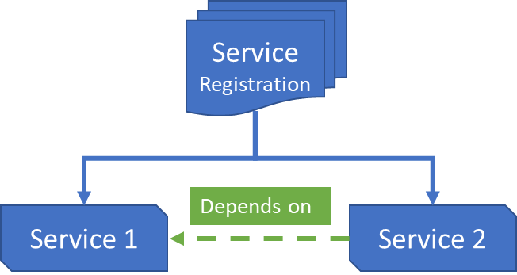
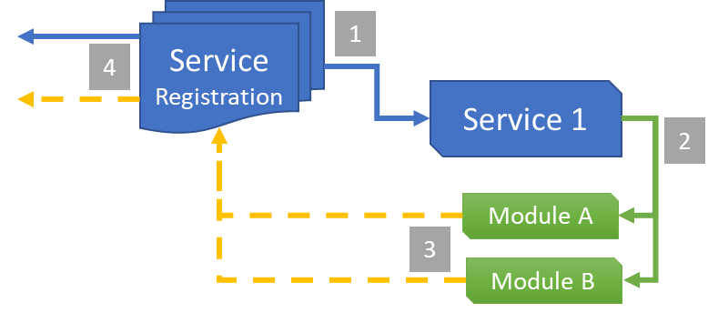
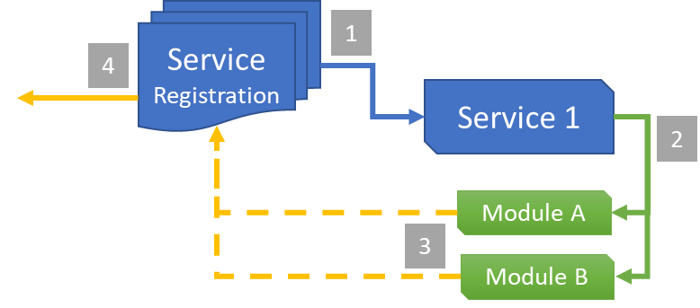
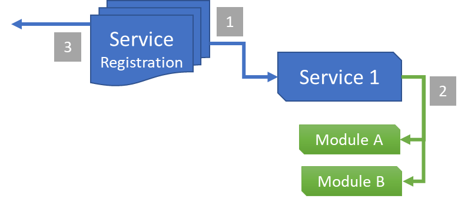

# Service Implementation patterns

***Last updated - 27th February 2024***

## Overview

This article will highlight some of the most common patterns used in service design / delivery, as used by the Reality Collective and its sponsors.

This is what this article will cover:

* [Single Service](#single-service)
* [Cooperative Services](#cooperative-services)
* [Service Providers Model](#service-providers-model)
* [Module Driven Design](#module-driven-design)
* [Managed Service](#managed-service)
* [Tips and tricks](#tips-and-tricks)

Time to begin.

---

## Single Service

<br/>


The most common and simple service, a singular entity that enables a single capability or operation, for example:

* A Settings Service - managing a central repository of runtime settings for an application

* Menu Service - controlling screen / ui flow for an application, including managing state.

---

## Cooperative Services

<br/>



In some scenarios, it is common for two services to be interlinked, each providing a distinct service / operation particular to that service, yet dependent on another service to provide "common" functionality.

The Service Framework supports two primary approaches for establishing service dependencies:

### Constructor Injection (Recommended)

The preferred approach is to use **constructor-based dependency injection**, where Service 2 declares its dependency on Service 1 directly in its constructor. The Service Framework will automatically resolve and inject the dependency during service registration:

```csharp
public class Service2 : BaseServiceWithConstructor, IService2
{
    private readonly IService1 service1;

    public Service2(string name, uint priority, BaseProfile profile, IService1 service1)
        : base(name, priority)
    {
        this.service1 = service1 ?? throw new ArgumentNullException(nameof(service1));
    }
}
```

This approach provides compile-time safety, clearer dependencies, and eliminates the need for null checks during initialization.

:::tip

For detailed information on dependency injection, including registration order requirements and advanced patterns, check out the [Dependency Injection](./07_dependency-injection.md) guide.

:::

### Runtime Service Retrieval

Alternatively, Service 2 can retrieve Service 1 at runtime during initialization or later using `GetService<IService1>()`. This approach offers more flexibility but requires manual null checking:

```csharp
public override void Initialize()
{
    var service1 = ServiceManager.Instance.GetService<IService1>();
    if (service1 == null)
    {
        Debug.LogError("Service1 is required but not registered!");
        return;
    }
}
```

:::note

When using either approach, care must be taken to ensure the services are registered in the correct order. You can also utilize Scriptable Objects as configurable assets to provide weak references between services.

:::

---

## Service Providers Model

<br/>



By default, when Services and their modules are registered, they are all accessible via the Service Framework, allowing instant access to either through a `GetService<IService>` call.  The registration flow is as follows:

1. Services are read through configuration and registered with the Service Framework
2. Service Modules contained within the Service configuration are initialized by the service
3. The modules then also Registered with the Service Framework (enabling the Service Framework to manage all entities)
4. The primary method for accessing the service is via calling `GetService<IService>`

This is the pattern enabled for services by default.  Primarily it is recognized that the majority of the calls will be direct to the service, as the responsible party, it is still possible to use `GetService<IServiceModule>` when required.

:::tip

Alternatively, see the [Managed Service](#managed-service) design where you can manage modules only from within a service.

:::

---

## Module Driven Design

<br/>



Another pattern which is widely used (such as in the Leaderboard examples) whereby the Modules are the primary driver for access to the Services resources, with the Service itself mainly providing common functionality (such as authentication) for all the modules.

Similar to the [Service Providers Model](#service-providers-model), with the exception that only `GetService<IServiceModule>` is used to talk directly to the module that is required for an operation (e.g. a specific Leaderboard)

---

## Managed Service

<br/>#



With the [Service Providers Model](#service-providers-model), both Service and Module are always accessible, however, there are circumstances where you would want to limit access to the Modules managed by the service.

By adding the following override to a service:

```csharp
public override bool RegisterServiceModules => false;
```

This prevents registration of the Services Modules with the Service Framework, which gives much more control over the number and type of modules the services manage and in how they are constructed (whilst still retaining the benefits if so required).

This has been used to great effect in:

* Asset Loading services, to intercept Asset requests and perform different operations based on the type of asset received, handled by distinct handlers.
* Interaction Managers, to receive commands for operations to be performed in a scene, each then delegated to the modules currently registered with the service. (changeable at runtime).

---

## Tips and tricks

* There is no ONE path, you can mix and match how your services operate to meet the needs of your project.
* While services can be "configured" at design time, they can also be registered in code at runtime if you wish using `TryRegisterService<T>` && `TryRegisterServiceModule<T>`.
* Services and Modules can be activated / deactivated at anytime, they will always be known by the Service Framework and cannot "disappear" (unlike with Unity GameObjects/Components). Unless you unregister them at Runtime.
* Use the [Platform System](/docs/features/platform_system.md) to its fullest extent, as required and do not be afraid to create duplicates of services with different modules configured against different platforms.  But you can also configure Platforms for modules, so pick and choose.
* **REMEMBER**, a Service Interface or Module Interface, when registered with the Service Framework can **ONLY BE REGISTERED ONCE** else you will get a `Service Already Registered` error.  There can only be one.

---

## More information

for more information on the Service Framework, check out these additional links:

* [Introduction](./01_introduction.md)
* [Creating your first service](./02_getting_started.md)
* [Service design](./03_service_design.md)
* [Advanced services and sub services (data modules)](./04_advanced_services.md)
* [Scene based service loading](./06_scene_based_service_manager.md)
* [Dependency Injection](./07_dependency-injection.md)
* [Platform System](/docs/features/platform_system.md)
* [Roadmap](./08_roadmap.md)
