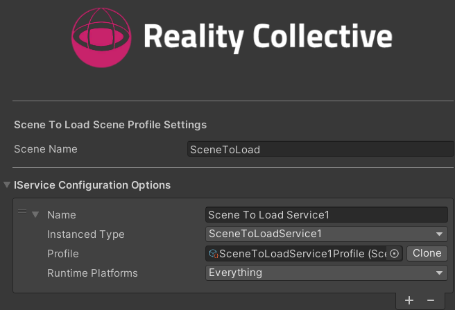
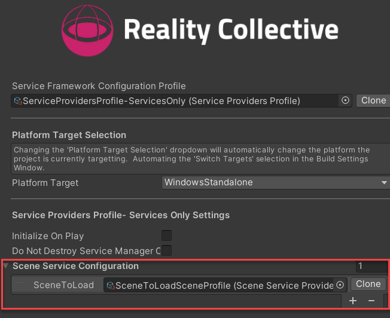
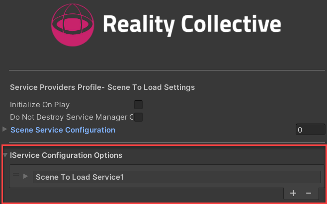
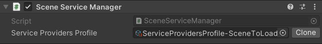

# Scene based Service Manager use

***Last updated - 27 February 2024***

## Overview

For the majority of cases, using a single Service Manager configuration is sufficient for projects, but there are cases when specific services or configuration require a finer approach that has different implementations based on the scene it is running in.

This can be handled within the service, but as scenes grow and the complexity of the project changes it can become harder to manage through code alone.

To support scene based services, as of version 1.0.5, the service framework has enabled a capability, through configuration, to allow developers to build scene specific service configurations.

## Use cases

Some of the most common uses for this behaviour are as follows:

* Scene dependent configuration
 Having a runtime service that requires a different behaviour or configuration per-scene, whereby the service acts differently or behaves differently based on the configuration profile attached to the service.
 Previously, this would have been only possible by attaching other configuration to the configuration profile that was scene aware, or having code that swapped the profile as the scene was loaded. Or even having hard coded validation of the scene name while running.

* Scene dependent services
  There are cases where a service only needs to live while a specific scene is loaded, a QR code recognizer for example which only needs to run while a scene containing a webcam or AR scene was running.
  This is usually critical when the service in question has a high performance cost while running.  Normally you would design the service to enable or disable itself when not in use, but depending on the requirements of the service, this might not free up memory or resources while offline.

There are likely more use cases, these are just a few to demonstrate the needs of such a requirement, and as stated, a lot of services likely will not require this level of granularity.

## Configuring Scene based service configuration

There are current two methods for configuring scene based service configuration:

* Using the `Global Service Manager` configuration profile, with the `Scene Service Configuration`.
* By Implementing the `Scene Service Manager` component in a scene with a `Service Providers Profile` for the scenes to load.

The pattern you use will largely depend on your projects architecture and style, but either approach works the same, as specific scenes are loaded, the Service Manager checks for any additional scenes to load, and when scenes are unloaded the scenes are removed/disposed of.

### Global Service Manager Configuration

If you want to configure the service configuration for specific scenes in a single place, then you can do so through your Global Service Manager configuration using the new `Scene Configuration Options`, this takes `Scene Service Provider Profile` assets which contain the service configuration for each scene.

1. Create a `Scene Service Provider Profile` through the project view using the menu option `Assets -> Create -> Service Framework -> Scene Service Provider Profile` (or alternatively through the `Right-click` menu using the same path), which will create a profile as shown below:

    

2. Name the scene the configuration is for in the `Scene Name` field.
3. Add your service configuration as normal in the `IService Configuration Options` section, selecting the Service Instance types, Runtime Platforms and selecting a profile if required.

Once you have created your `Scene Service Provider Profiles`, simply return to the `Global Service Manager` configuration profile and add them to the `Scene Service Configuration` list as shown below:

> The Scene name for the profile will be automatically shown in the line item for the profile.

Now configured, each time the selected scene is loaded or unloaded, the services configured will be interrogated.

### Scene Service Manager Configuration

As an alternate path, you can choose to contain the Services configuration within each scene instead of in the Global Service Manager.  To do this we simply add a custom `Scene Service Manager` component to a GameObject in our scene and then create and apply the [service configuration for the scene](./02_getting_started.md#creating-the-root-configuration-for-the-service-manager) as normal.

:::info[Global Service Manager Required!]

There **MUST** be a `Global Service Manager` instance running in the project prior to using a `Scene Service Manager`.  The Scene based manager depends on the Global Service Manager for managing services.
Just ensure one has been registered in a start-up scene prior to loading Scene Configuration, it does not need any services configured, just be present to provide the service registry.

:::

1. Create a `Service Providers Profile` (the same as the [Global Service Manager](./02_getting_started.md#creating-the-root-configuration-for-the-service-manager)) and configure the scenes it will manage.

    

    :::warning

    **DO NOT** configure the `Scene Service Configuration` for this type of service configuration as it will have no effect.  This configuration is only used by the `Global Service Manager`

    :::

2. Create or open a scene to add scene service configuration to.
3. Create or select a GameObject to add the `Scene Service Manager` component to.
4. In the `Add Component` menu, select `Service Framework -> Scene Service Manager` to add it to the GameObject.

    

5. Assign the profile created in step 1 to the `Service Providers Profile`.

With the `Scene Service Manager` configured in a scene, when the is loaded or unloaded, the services configured will be interrogated.

## Runtime operation

When the project is run, the order of operations is as follows:

1. Initialize the main Service Manager.
2. Load the base Service Configuration services.
3. Inspect for additional scene based service configuration.
4. Validate if any exist for the current scene and load.
5. On Scene load, check if any existing service configurations exist for the "loading" scene.
6. The `SceneServiceManager` also injects into this process to ensure and services IN the scene are loaded.
7. On Scene unload, any services for the scene unloading are also disposed of and destroyed (including any service modules).
8. On close of the application, all remaining services are disposed and destroyed.

Using Unity's own events, everything is managed and succinct to ensure only those services, either through configuration or code, are operational as requested.

## More information

for more information on the Service Framework, check out these additional links:

* [Introduction](./01_introduction.md)
* [Service design](./03_service_design.md)
* [Advanced services and sub services (data modules)](./04_advanced_services.md)
* [Service Patterns and implementations](./05_service_patterns.md)
* [Dependency Injection](./07_dependency-injection.md)
* [Platform System](/docs/features/platform_system.md)
* [Roadmap](./07_roadmap.md)
