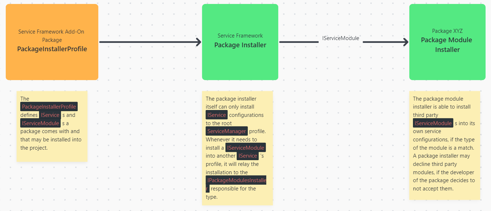

# Package Installer

***Last updated - 27th April 2023***

## Overview

The platform installer system provides a robust way to deploy configuration and assets from a Unity Package in to a runtime solution, it also provides cross-package capabilities between different packages using the Package Installer to deploy dependent configuration on demand.

This is what this article will cover:

* [Package Installer Overview](#package-installer-overview)
* [Core components](#core-components)
* [Examples](#examples)

---

## Package Installer Overview

At its core, the Service Framework provides a Package Installer system which can detect and react to Package Installer Profiles to deploy configuration and assets to a solution and other packages implementing a Package Installer Profile.

## Core components

The Package Installer framework is built up of the following components:

### Package Installer Profile

The `PackageInstallerProfile` is a scriptable object asset type that defines `IService`'s and `IServiceModule`'s that a package exposes for use with the `ServiceManager`.

### Package Installer Component

The `PackageInstaller` will install `IService`'s and `IServiceModule`'s defined in a `PackageInstallerProfile` to the project.

### Asset Installer

The `AssetInstaller` will install assets, such as Prefabs, Meshes, Textures etc. that come with a package into the project's Assets directory.

### Package Module Installer

Each package that wants other developers to be able to install their own `IServiceModule`'s into their services, must define and implement a `IPackageModuleInstaller` that will take care of the installation.

## Examples

* The `com.realitytoolkit.camera` package comes with the `CameraService`. It defines a `PackageInstallerProfile` that will make use of the `PackageInstaller` to install the `CameraService` to the project. In this scenario we DO NOT need a `IPackageModuleInstaller` since the camera package has full authority over the camera service and its modules.

* The `com.realitytoolkit.pico` package comes with a `PicoInputServiceModule` that can be registered with the `InputService`. The `InputService` is a service that is outside of the PICO packge's authority, since it lives in the `com.realitytoolkit.core` package. That's why the PICO package must ask the `CorePackageModuleInstaller`, which is a `IPackageModuleInstaller` implementation, to install the `PicoInputServiceModule` to the `InputServiceProfile`.

---

## More information

for more information on the Service Framework, check out these additional links:

* [Introduction](../basics/01_introduction.md)
* [Roadmap](../basics/07_roadmap.md)
