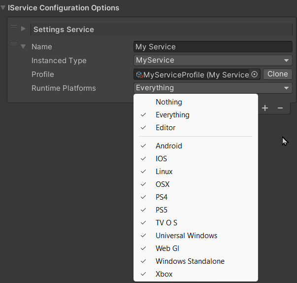

# Platform System

***Last updated - 27th February 2024***

## Overview

This article will highlight some of the most common patterns used in service design / delivery, as used by the Reality Collective and its sponsors.

This is what this article will cover:

* [Platform System Usage](#platform-system-usage)
* [BuiltIn Platforms](#builtin-platforms)
* [Platform Switcher](#platform-switcher)
* [Service and Module Platform Selection](#service-and-module-platform-selection)
* [IPlatform](#iplatform)
* [Tutorial: Building your own platform](#building-your-own-platform)
* [Tips and tricks](#tips-and-tricks)

Time to begin.

---

## Platform System Usage

The platform system embedded inside the Service Framework enables a multitude of capabilities from simpler and quicker platform switching, to allowing services and modules to ONLY run when a specific platform is detected as running, this enables a lot more variety than just using `#if` processors everywhere (and more manageable code).

This platform detection works at BOTH in the Player runtime as well as in the Editor, which each uniquely identifying their activation based on the characteristics of each and not just the currently detected Unity platform.

This capability can also be extended and is used by toolkits such as the MRTK2, [Reality Toolkit](https://realitytoolkit.realitycollective.net/) and the XRTK, to create custom platforms such as the Meta Quest and Pico, which require the presence of the vendor API in order to enable custom platforms.

---

## BuiltIn Platforms

By default, the Service Framework supports all of the built-in platforms that Unity supports "out of the box", including:

* Android
* iOS
* Linux
* OSX
* PlayStation*
* TVOS*
* Windows Universal (UWP)
* WebGL
* Windows Standalone
* Xbox*
* Nintendo*

:::info

* requires 3rd party licensed plugin

:::

---

## Platform Switcher


On the inspector for the **Global Service Manager**, the Service Framework provides a handy utility to automatically switch the `Active` build target while the editor is running.  In comparison, it is approximately 50% quicker using the Platform Switcher over using Unity's built in "Switch Platform" option in the Build Settings screen.

To change to another platform to check how things are compiling, you simply select a different `Platform Target` in the drop down.

---

## Service and Module Platform Selection



When configuring when Services and Modules activate (when the Service Framework will register them), you can choose which platforms the service or module that have to be present for them to start.

There is no limitation (except to say that a service can only register once per platform) and you can either create duplicate services for each platform with platform variations, or use a single service with multiple Service Modules, each configured for specific platforms.

:::warning

Remember a Service or Module can only be registered ONCE per interface.

:::

:::note

Code still has to compile in the editor regardless of what platform the Service or Module is targeting, so you will still need to include Preprocessor Directives (#if statements) for any code that cannot be compiled on different platforms.

:::

---

## IPlatform

The IPlatform interface defines the constraints and conditions which will determine what platform is currently active. this is defined as:

|Property|Type|Scope|Description|
|---|---|---|---|
|`Name`|string|Runtime & Editor|The visible name for the platform|
|`IsAvailable`|bool|Runtime & Editor|Is the platform currently available at runtime|
|`Platform`|IPlatform[] (array)|Runtime & Editor|The list of platforms that this Platform overrides and makes unavailable|
|`IsBuildTargetAvailable`|string|Editor Only|While in the Editor, is this platform active in the Editor|
|`ValidBuildTargets`|IPlatform[] (array)|Editor Only|When in the editor, what are the Unity base targets this Platform requires|

Any new platforms needs to inherit from `BasePlatform` and provides overrides for the above properties where applicable.

:::info

Check the [existing platforms](https://github.com/realitycollective/com.realitycollective.service-framework/tree/development/Runtime/Definitions/Platforms) currently implemented in the Service Framework for examples.

:::

---

## Building your own platform

To build your own platform, you simply need to create a new class that inherits from `BasePlatform` and then implement the overrides as required to define **WHEN** your platform should be active.  There are no limitations on the conditions you set, whether they are for:

* Ensuring a path exists.
* Validating an API is valid (and returning a value, as in Quest).
* The day of the week :D

An example platform, as used in the Reality Toolkit, is the Pico platform, which is active when The build platform is Android AND that the Pico API is available:

```csharp
// Copyright (c) Reality Collective. All rights reserved.
// Licensed under the MIT License. See LICENSE in the project root for license information.

using RealityCollective.Extensions;
using RealityCollective.ServiceFramework.Definitions.Platforms;
using RealityCollective.ServiceFramework.Interfaces;
using System.Collections.Generic;
using System.Linq;
using Unity.XR.PXR;
using UnityEngine;
using UnityEngine.XR;
using UnityEngine.XR.Management;

namespace RealityToolkit.Pico
{
    /// <summary>
    /// Used by the toolkit to signal that a feature is available on the Pico platform.
    /// </summary>
    [System.Runtime.InteropServices.Guid("91d05795-d44e-4a4d-8055-e770b592137f")]
    public class PicoPlatform : BasePlatform
    {
        private const string xrDisplaySubsystemDescriptorId = "PicoXR Display";
        private const string xrInputSubsystemDescriptorId = "PicoXR Input";

        private bool IsXRLoaderActive => XRGeneralSettings.Instance.IsNotNull() &&
                    ((XRGeneralSettings.Instance.Manager.activeLoader != null && XRGeneralSettings.Instance.Manager.activeLoader.GetType() == typeof(PXR_Loader)) ||
                    (XRGeneralSettings.Instance.Manager.activeLoaders != null && XRGeneralSettings.Instance.Manager.activeLoaders.Any(l => l.GetType() == typeof(PXR_Loader))));

        /// <inheritdoc />
        public override IPlatform[] PlatformOverrides { get; } =
        {
            new AndroidPlatform()
        };

        /// <inheritdoc />
        public override bool IsAvailable
        {
            get
            {
                if (!IsXRLoaderActive)
                {
                    // The platform XR loader is not active.
                    return false;
                }

                var displaySubsystems = new List<XRDisplaySubsystem>();
                SubsystemManager.GetSubsystems(displaySubsystems);
                var xrDisplaySubsystemDescriptorFound = false;

                for (var i = 0; i < displaySubsystems.Count; i++)
                {
                    var displaySubsystem = displaySubsystems[i];
                    if (displaySubsystem.SubsystemDescriptor.id.Equals(xrDisplaySubsystemDescriptorId) &&
                        displaySubsystem.running)
                    {
                        xrDisplaySubsystemDescriptorFound = true;
                    }
                }

                // The XR Display Subsystem is not available / running,
                // the platform doesn't seem to be available.
                if (!xrDisplaySubsystemDescriptorFound)
                {
                    return false;
                }

                var inputSubsystems = new List<XRInputSubsystem>();
                SubsystemManager.GetSubsystems(inputSubsystems);
                var xrInputSubsystemDescriptorFound = false;

                for (var i = 0; i < inputSubsystems.Count; i++)
                {
                    var inputSubsystem = inputSubsystems[i];
                    if (inputSubsystem.SubsystemDescriptor.id.Equals(xrInputSubsystemDescriptorId) &&
                        inputSubsystem.running)
                    {
                        xrInputSubsystemDescriptorFound = true;
                    }
                }

                // The XR Input Subsystem is not available / running,
                // the platform doesn't seem to be available.
                if (!xrInputSubsystemDescriptorFound)
                {
                    return false;
                }

                // Only if both, Display and Input XR Subsystems are available
                // and running, the platform is considered available.
                return true;
            }
        }

#if UNITY_EDITOR
        /// <inheritdoc />
        public override bool IsBuildTargetAvailable => IsXRLoaderActive && base.IsBuildTargetAvailable;

        /// <inheritdoc />
        public override UnityEditor.BuildTarget[] ValidBuildTargets { get; } =
        {
            UnityEditor.BuildTarget.Android
        };
#endif
    }
}
```

As you can see, the `IsAvailable` property is only active at runtime if several conditions are met:

* Has the OpenXR subsystem been configured and active?
* Is the XR Display Subsystem running (runtime)?
* Is the XR Input Subsystem running (runtime)?

---

## Tips and tricks

There is not much to say about the Platform system, any script inheriting from `BasePlatform` (which implements `IPlatform`) is automatically detected and picked up by the Service Framework, so long as the code in your project can "**See**" the code (not hidden behind an assembly definition).

But creating Platforms to set conditions to define when a Service Or Module is very versatile and could even be used within your project based on conditions of the player / title when it starts.

:::info

Remember, Platforms are ONLY evaluated when the application starts, they are not added/registered at runtime.  (So if you have a platform based on a condition, it must be accessible in the editor at design time to assign it, even if it is only evaluated at runtime.)

:::

---

## More information

for more information on the Service Framework, check out these additional links:

* [Introduction](../basics/01_introduction.md)
* [Creating your first service](../basics/02_getting_started.md)
* [Service design](../basics/03_service_design.md)
* [Advanced services and sub services (data modules)](../basics/04_advanced_services.md)
* [Service Patterns and implementations](../basics/05_service_patterns.md)
* [Scene based service loading](../basics/06_scene_based_service_manager.md)
* [Roadmap](../basics/07_roadmap.md)
