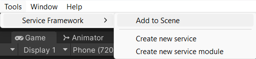

# Welcome to the Service Framework by the Reality Collective

The Service Framework is an extensible service framework to build highly performant components for your Unity projects by the [Reality Collective](https://realityCollective.io).

## Overview

The Service framework provides a service repository for enabling background services to run efficiently in a Unity project, it features capabilities such as:

* Platform specific operation - choose which platforms your service runs on.
* Zero Latency from Unity operations - services are fully c# based with no Unity overhead.
* Ability to host several sub-services (service modules) as part of a service, automatically maintained by a parent service and also platform aware.
* Fully configurable with Scriptable profiles - Each service can host a configuration profile to change the behavior of your service without changing code.

## Requirements

- [Unity 2020.3 and above](https://unity.com/)
- [RealityCollective.Utilities](https://github.com/realitycollective/com.realitycollective.utilities)

### OpenUPM

[](https://openupm.com/packages/com.realitycollective.service-framework/)

The simplest way to getting started using the utilities package in your project is via OpenUPM. Visit [OpenUPM](https://openupm.com/docs/) to learn more about it. Once you have the OpenUPM CLI set up use the following command to add the package to your project:

```text
    openupm add com.realitycollective.service-framework
```

> For more details on using [OpenUPM CLI, check the docs here](https://github.com/openupm/openupm-cli#installation).

Alternatively you can connect to the repository directly from Unity using the "Add package from Git url" option in the [Unity Package Manager](https://docs.unity3d.com/Manual/upm-ui.html) and using the URL for the repository below:<br/>
[https://github.com/realitycollective/com.realitycollective.service-framework.git](https://github.com/realitycollective/com.realitycollective.service-framework.git)

## Build Status

| branch | build status |
| --- | --- |
| main | [](https://github.com/realitycollective/com.realitycollective.service-framework/actions/workflows/main-publish.yml) |
| development | [](https://github.com/realitycollective/com.realitycollective.service-framework/actions/workflows/development-buildandtestupmrelease.yml)|

---

## Use cases

The service framework has been the foundation behind such toolkits as Microsoft's MRTK and open source projects like the XRTK as well as the newly formed Reality Toolkit.  These use the framework to enable such use cases as:

* A platform independent input system - A single service able to route input data from multiple controllers on various platforms, each controller only activates on the platform it was designed for.
* An Authentication service - Able to integrate with multiple authentication providers as needed through a single interface.
* A networking service - Utilizing multiple endpoints for Lobby's, communication routes and data sharing.
* A Leaderboard system - A leader board service can manage access to different leader board system/solution or simply manage sub services to control access to different types of Leaderboard, all in one place.
* A "Settings" Service - to manage and control the application state and various runtime options, regardless of which scene you are currently in.

The possibilities are almost endless.

## Quickstart

> If you want a more in-depth tutorial on the Service Framework and creating services, check out the [Introduction](./basics/01_introduction.md) series.

### 1. Creating a service

A fully featured "**Service Generator**" is included with the Service Framework to get you started quickly, by simply giving a service a name and a namespace with which to run from, the generator will quickly create:

* An interface to identify your service to the Service Framework (all services are identified by their parent interface)
* A configuration profile - to customize to the needs of your service (optional, delete if not required)
* The Service Implementation - You service to do with as you wish.


### 2. Configuring your service

With your service created, it will need to be registered with an active "Service Manager" in a scene, this can either use the provided "Service Manager Instance" component on a GameObject, or consume it using a private property on a class of your own.

> Note, at this time, only a single Service Framework Manager can be active in the scene at a time.  If you are intending to use the Framework with toolkit's such as the Reality Toolkit which already has an instance of the Service Framework embedded, then you will need to use the toolkit's endpoints to communicate with the Service Framework.

Simply use the handy Editor function provided by the Reality Collective to add a **Service Manager Instance** to a scene using:

> Reality Collective -> Service Framework -> Add to Scene



Once added, click on the **Create a new configuration profile** to create the configuration needed to run your service and add the service you generated using the handy drop downs to locate it.
P.S. Don't forget to also set the Platforms your service needs to run on, if in doubt select "Everything", I'm sure it'll be fine :D


### 3. Accessing your running services

Your services are available at any time from anywhere in your code by simply requesting the service from the Service Manager using its interface, for example:

```csharp
    var myService = ServiceManager.Instance.GetService<MyServiceInterface>();
```

Alternatively, there are also "TryGet" versions of the Service endpoints which **return a bool** to denote the service retrieval was successful and an **out** parameter to output the service instance, for example:

```csharp
    IService myServiceInstance;
    if(!ServiceManager.Instance.TryGetService<MyServiceInterface>(out myServiceInstance))
    {
        // Do something if your service was not found.
    }
```

## Feedback

Please feel free to provide feedback via the [Service Framework dev channel here](https://github.com/realitycollective/com.realitycollective.service-framework/issues), all feedback. suggestions and fixes are welcome.

## Documentation, work in progress

The documentation that gives an overview and walk-through of the Service Framework contains enough to get going, but we are aware that more documentation is needed for the Service Framework, including examples (currently the Reality Toolkit is the best set of examples).  These will be improved over time.

---

## Related Articles

* [Introduction](./basics/01_introduction.md)
* [Creating your first service](./basics/02_getting_started.md)
* [Service design](./basics/03_service_design.md)
* [Advanced services and sub services (service modules)](./basics/04_advanced_services.md)
* [Service Patterns and implementations](./basics/05_service_patterns.md)
* [Platform System](./features/platform_system.md)
* [Roadmap](./basics/07_roadmap.md)

---

## Raise an Information Request

If there is anything not mentioned in this document or you simply want to know more, raise an [RFI (Request for Information) request here](https://github.com/realitycollective/realitytoolkit.dev/issues/new?assignees=&labels=question&template=request_for_information.md&title=).